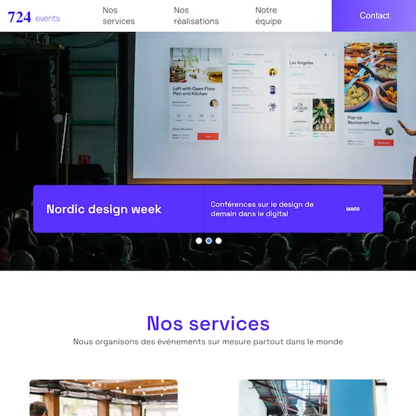

## Description
L'application est le site d'une agence evenementielle.
## Pre-requis
- NodeJS  >= v16.14.1

## Installation
- `yarn install`

## Lancement de l'application
- `yarn start`

## Tests
- `yarn test`

## 724 Events - Projet de soutenance n°10 de la formation Développeur Intégrateur Web

### Ce projet n'est pas responsive.
Dans ce projet, j'ai été chargé de débugger et de finaliser le développement d'un site one-page. Pour ce faire, j'ai utilisé les Chrome DevTools et mes compétences en JavaScript et React pour identifier et résoudre les problèmes. J'ai également complété le cahier de recette, qui détaille les scénarios de test nécessaires pour vérifier le bon fonctionnement du site. Enfin, j'ai utilisé Yarn et Node.js pour la gestion du projet, et j'ai versionné mon travail avec GitHub en utilisant Visual Studio Code comme éditeur de code.

## Les technologies utilisées

- JavaScript
- React.js
- Les chrome DevTools